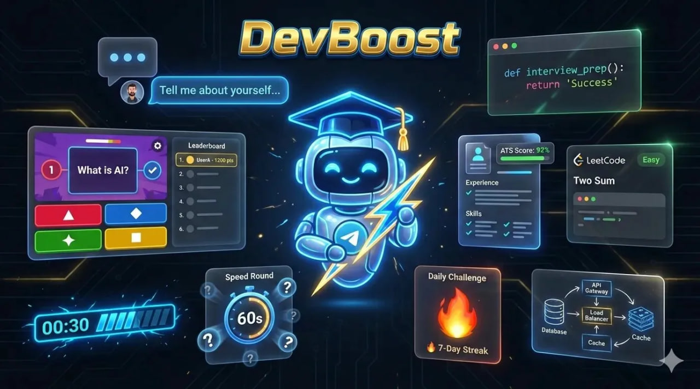

<div align="center">
  
</div>

<div align="center">

[](https://python.org)
[](https://core.telegram.org/bots)
[](https://groq.com)
[](https://github.com/matan4749/hiring-hero-bot/stargazers)

</div>

<br/>

## 🎯 What is Hiring Hero Bot?

An **AI-powered Telegram bot** that runs interactive Python quizzes in both **English and Hebrew (עברית)**. Uses **Groq's LLM** for AI-generated hints and explanations, with a full quiz bank covering easy → hard difficulty levels.

<br/>

## 🖼️ Preview

<div align="center">
  
</div>

<br/>

## ✨ Features

- 🌍 **Bilingual** — Full support for English and Hebrew
- 🧠 **AI Hints** — Groq LLM generates contextual tips per question
- 📈 **Difficulty Levels** — Easy / Medium / Hard question bank
- 🏆 **Scoring System** — Real-time score tracking per session
- ⏱️ **Timed Quizzes** — Auto-advance with countdown timer
- 🎨 **Styled Messages** — Emoji-rich, visually engaging Telegram UI
- ☁️ **Hosted on Heroku** — Always-on via Procfile deployment

<br/>

## 🛠️ Tech Stack

| Component | Technology |
|-----------|-----------|
| Language | Python 3.10+ |
| Bot Framework | pyTelegramBotAPI (telebot) |
| AI / LLM | Groq API |
| Hosting | Heroku |
| Config | Environment variables |

<br/>

## 🚀 Getting Started

```bash
# Clone
git clone https://github.com/matan4749/hiring-hero-bot.git
cd hiring-hero-bot

# Install dependencies
pip install -r requirements.txt

# Set environment variables
export TELEGRAM_TOKEN="your_bot_token"
export GROQ_API_KEY="your_groq_key"

# Run
python hiring_hero_bot.py
```

### Get your tokens:
- **Telegram Bot Token** → Talk to [@BotFather](https://t.me/BotFather)
- **Groq API Key** → [console.groq.com](https://console.groq.com)

<br/>

## 📁 Files

```
hiring-hero-bot/
├── hiring_hero_bot.py   # Main bot logic + quiz bank
├── requirements.txt     # Python dependencies
├── Procfile             # Heroku process config
└── IMG_8002.png         # Bot preview screenshot
```

<br/>

## 💬 How It Works

1. User starts the bot with `/start`
2. Bot asks for language preference (EN / HE)
3. Quiz begins — multiple choice questions appear
4. AI hint available on request via Groq LLM
5. Score displayed at the end with detailed breakdown

<br/>

<div align="center">

Made with ❤️ by [Matan Amar](https://matan.life)


</div>
